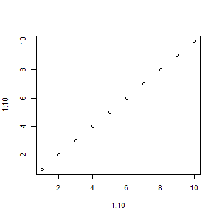

## Slide 2Read-And-Delete

1. Edit YAML front matter
2. Write using R Markdown
3. Use an empty line followed by three dashes to separate slides!

--- .class #id 

## Slide 3


```r
plot(1 : 10, 1 : 10)
```

 

--- 

## Slide 4

test 4

--- 

## Slide 5

test 5
